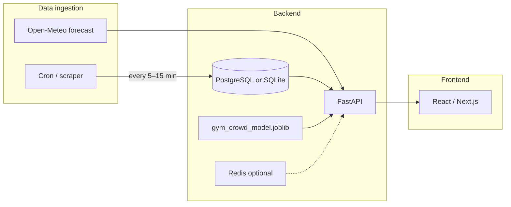

You already have the hard ML pieces: `gym_crowd_model.joblib`, `src/features.py`, and a prediction flow. What’s missing is the **live data loop** (collect actual crowd → run model → serve to UI). Below are practical stack options and deployment paths for that.

---

## What “real-time” means for your app

Split it into two streams:

| Stream        | What it shows                                      | Data source                                                 |
| ------------- | -------------------------------------------------- | ----------------------------------------------------------- |
| **Actual**    | Live gym occupancy                                 | Scraper/cron writing to DB (same format as `gym_crowd.csv`) |
| **Predicted** | Model output for “now” (and optionally next hours) | Your joblib model + timestamp + weather                     |

Your model needs `timestamp`, `name`, `capacity`, and weather — not `current`. For live predictions you’ll want the **forecast API**, not the archive API your `features.py` uses today:

- Archive (training/history): `archive-api.open-meteo.com`
- Live/forecast (production): `api.open-meteo.com/v1/forecast`

---

## Recommended architecture



Typical flow:

1. **Cron job** scrapes gym occupancy every 5–15 minutes → saves to DB.
2. **API** loads the model once at startup.
3. On each request (or scheduled job), API builds features for “now”, calls `pipeline.predict()`, returns actual + predicted + occupancy %.
4. **Frontend** polls every 30–60s (or uses WebSockets) to refresh the chart.

---

## Stack options (pick one tier)

### Option A — MVP / fastest to ship (good for a class project or personal app)

| Layer     | Tech                                         | Why                                                     |
| --------- | -------------------------------------------- | ------------------------------------------------------- |
| Backend   | **FastAPI** + `joblib`                       | Fits your Python/sklearn stack; simple REST             |
| Frontend  | **Streamlit** or **Next.js**                 | Streamlit = almost no frontend code; Next.js = nicer UI |
| DB        | **SQLite** or **Supabase** (hosted Postgres) | SQLite locally; Supabase free tier for hosted           |
| Scheduler | **cron** or **GitHub Actions**               | Run scraper on a schedule                               |
| Deploy    | **Railway** or **Render** (all-in-one)       | Low ops, supports Python + cron                         |

**Best if:** you want something live in days, single gym, low traffic.

---

### Option B — Production web app (recommended balance)

| Layer    | Tech                                                           | Why                                       |
| -------- | -------------------------------------------------------------- | ----------------------------------------- |
| Backend  | **FastAPI**                                                    | Async, OpenAPI docs, easy model serving   |
| Frontend | **Next.js** (React) + **Recharts** or **Chart.js**             | Good charts, mobile-friendly, easy deploy |
| DB       | **PostgreSQL** (Supabase / Neon / Railway)                     | Store time-series occupancy + predictions |
| Cache    | **Redis** (optional)                                           | Cache “current prediction” for 1–5 min    |
| Jobs     | **APScheduler** in FastAPI or separate **cron container**      | Scrape + precompute predictions           |
| Auth     | **Clerk** or **Supabase Auth** (optional)                      | Only if you need login                    |
| Deploy   | **Vercel** (frontend) + **Railway / Fly.io / Cloud Run** (API) | Common, cheap, scales                     |

**Best if:** you want a real product feel, multiple users, charts that update live.

---

### Option C — Mobile-first

| Layer  | Tech                                                          |
| ------ | ------------------------------------------------------------- |
| API    | FastAPI (same as above)                                       |
| Mobile | **React Native (Expo)** or **Flutter**                        |
| Push   | **Firebase Cloud Messaging** (“gym is busy now”)              |
| Deploy | API on **Google Cloud Run**; app via **Expo EAS** / App Store |

**Best if:** users mainly check crowd on their phone.

---

### Option D — Serverless / minimal infra

| Layer     | Tech                                                             |
| --------- | ---------------------------------------------------------------- |
| API       | **AWS Lambda** or **Cloudflare Workers** + container for sklearn |
| Frontend  | **Vercel** static/Next.js                                        |
| DB        | **DynamoDB** or Supabase                                         |
| Scheduler | **EventBridge** / **Cloud Scheduler**                            |

**Caveat:** sklearn + pandas on Lambda is awkward (cold starts, package size). Prefer **Cloud Run** or a small VM for the ML API unless you convert to ONNX.

---

## Suggested stack for your project

Given your repo (`joblib`, `src/features.py`, CSV-based data), **Option B** is the sweet spot:

```
Next.js          →  dashboard, live chart, “busy / quiet” badge
FastAPI          →  /predict/now, /occupancy/latest, /history
PostgreSQL       →  occupancy readings + optional prediction log
Docker           →  bundle model + sklearn + FastAPI
Railway/Render   →  one place for API + DB + cron
Vercel           →  frontend (free tier)
```

---

## Backend API shape (sketch)

```python
GET  /api/occupancy/latest     # actual crowd from DB
GET  /api/predict/now          # model prediction for current hour
GET  /api/predict/forecast?hours=24   # next N hours (loop timestamps + forecast weather)
GET  /api/history?from=...&to=...     # actual vs predicted chart data
```

Load the model once at startup:

```python
pipeline = joblib.load("gym_crowd_model.joblib")

@app.get("/api/predict/now")
def predict_now():
    row = pd.DataFrame([{
        "timestamp": pd.Timestamp.now(tz="Asia/Singapore").isoformat(),
        "name": "University Sports Centre - Gym",
        "capacity": 110,
    }])
    features = prepare_features(row, weather_df=None)  # fetch live weather
    pred = pipeline.predict(features[FEATURE_COLS])[0]
    return {"predicted": int(round(pred)), "occupancy_pct": pred / 110}
```

---

## Deployment guide (Option B)

### 1. Containerize the API

```dockerfile
FROM python:3.11-slim
WORKDIR /app
COPY requirements.txt .
RUN pip install --no-cache-dir fastapi uvicorn joblib pandas scikit-learn
COPY src/ src/
COPY gym_crowd_model.joblib .
CMD ["uvicorn", "src.api:app", "--host", "0.0.0.0", "--port", "8000"]
```

Pin `scikit-learn` to the version you trained with.

### 2. Add a database

Store readings in a simple table:

```sql
CREATE TABLE occupancy (
  id SERIAL PRIMARY KEY,
  timestamp TIMESTAMPTZ NOT NULL,
  name TEXT NOT NULL,
  current INT NOT NULL,
  capacity INT NOT NULL,
  created_at TIMESTAMPTZ DEFAULT NOW()
);
```

### 3. Deploy backend (pick one)

| Platform             | Steps                                                            | Cost                |
| -------------------- | ---------------------------------------------------------------- | ------------------- |
| **Railway**          | Connect GitHub → add Postgres → deploy Dockerfile → set env vars | ~$5/mo              |
| **Render**           | Web Service + Cron Job + Postgres                                | Free tier available |
| **Fly.io**           | `fly launch` + volume for SQLite (simpler, less ideal for prod)  | Low                 |
| **Google Cloud Run** | Push image to GCR → deploy with min instances=0                  | Pay per request     |

Railway/Render are the easiest if you’re new to deployment.

### 4. Deploy frontend

```bash
# Next.js on Vercel
vercel deploy
# Set NEXT_PUBLIC_API_URL=https://your-api.railway.app
```

### 5. Schedule the scraper

- **Render Cron Job** or **Railway cron**: run your scraper every 10 minutes.
- Or **GitHub Actions** on `schedule:` if the scraper is lightweight and doesn’t need low latency.

### 6. Wire up “real-time” UI

- Poll `GET /api/occupancy/latest` and `/api/predict/now` every **30–60 seconds**.
- Or use **Server-Sent Events (SSE)** from FastAPI if you want push-style updates without WebSockets.

For a gym crowd app, polling every minute is usually enough; true WebSockets are optional.

---

## Things to fix before production

1. **Weather for live data** — extend `prepare_features()` to call the forecast API when scoring “now” or future hours.
2. **Retrain on full data** — export the model after fitting on all rows, not just the train split.
3. **Separate inference from plotting** — `src/predict.py` is a test script; add `src/api.py` for the web service.
4. **Model + features consistency** — your saved `gym_crowd_model.joblib` may be the sklearn-only pipeline (no `GymFeatureEngineer`). At inference, either:
   - load that model and call `prepare_features()` first (as in your test script), or
   - save the full `full_pipeline` that includes feature engineering.
5. **CORS** — enable FastAPI CORS for your Vercel frontend domain.

---

## Cost snapshot (small app)

| Setup                                | Monthly cost |
| ------------------------------------ | ------------ |
| Vercel (frontend) + Render free tier | $0           |
| Railway (API + Postgres)             | ~$5–10       |
| Domain                               | ~$10/year    |
| Open-Meteo weather                   | Free         |

---

## Suggested path

1. **Week 1:** FastAPI + load joblib + `/predict/now` + live weather.
2. **Week 2:** Postgres + scraper cron + `/occupancy/latest`.
3. **Week 3:** Next.js chart (actual vs predicted) + deploy to Railway + Vercel.

If you want the absolute fastest demo: **Streamlit + FastAPI on Railway in one repo** — one Python app that loads the model and renders the chart. Less polished, but live in an afternoon.

I can outline a concrete folder structure (`src/api.py`, Docker, Next.js pages) or a step-by-step Railway deploy checklist if you say which option (A, B, or C) you prefer. In Agent mode I can scaffold the FastAPI service and Dockerfile directly.

## My Finalized Decision

- Backend: FastAPI
- Frontend: Next.js (React) + Recharts or Chart.js
- DB: Progres, deploy on Supabase: Store weather data
- Cache: Redis: Cache "current prediction" for 15 min
- Jobs (Scheduled): EventBridge or GitHub Action: Scrape + precompute predictions. Predict ahead for 1 day. Every 30 minutes, scrape data to update prediction
- Deploy: Vercel (frontend) + Render (FastAPI backend)
- Domain: dandinh.net Route 53


